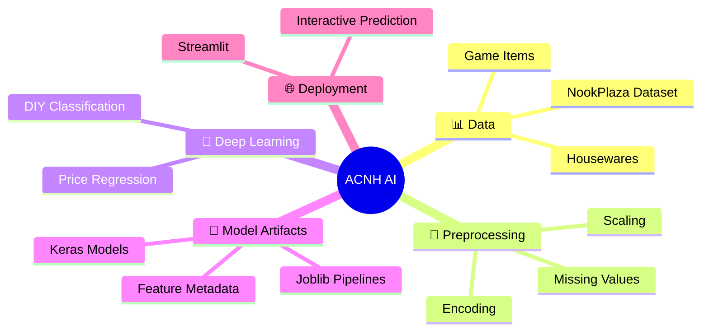
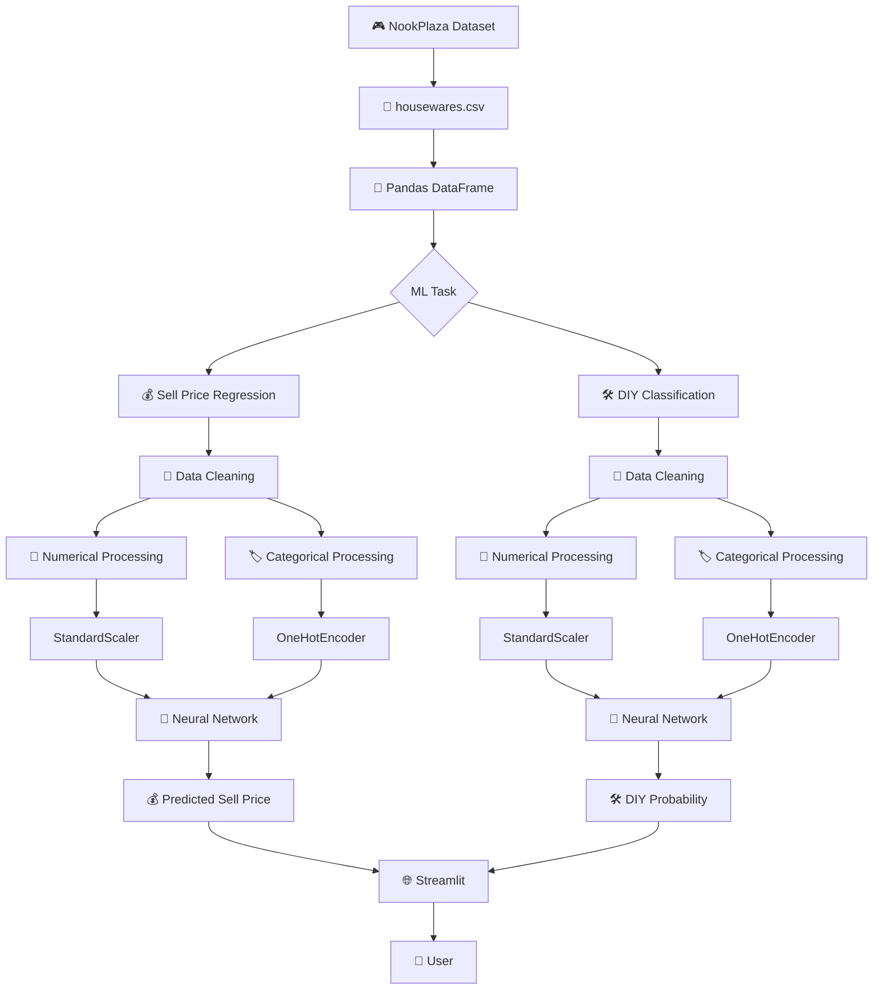
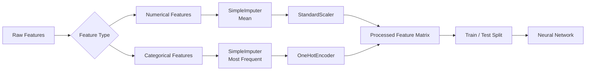
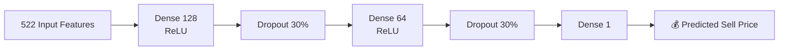
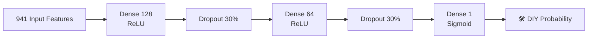
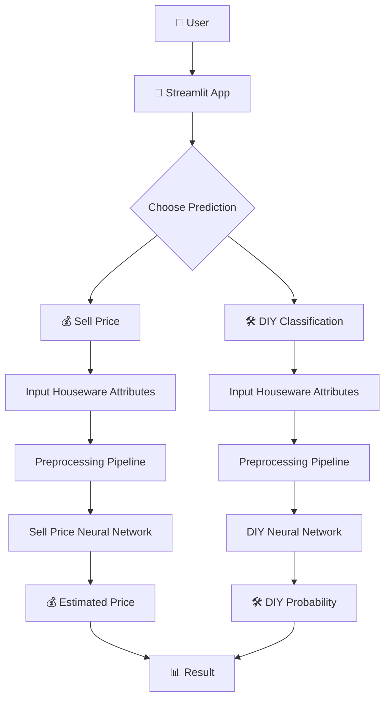
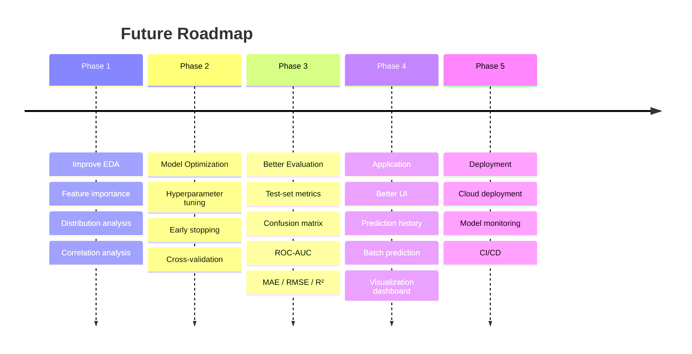

# 🏝️ Animal Crossing: New Horizons — AI Houseware Predictor

<p align="center">


### 🎮 Turning Animal Crossing Data into Machine Learning

**Predict houseware selling prices 💰 • Classify DIY items 🛠️ • Explore game-item data 📊**

<br>

[](https://www.python.org/)
[](https://www.tensorflow.org/)
[](https://pandas.pydata.org/)
[](https://scikit-learn.org/)
[](https://streamlit.io/)
[](https://jupyter.org/)

</p>

---

## 🌟 Project Overview

This project applies **data science and deep learning** to the *Animal Crossing: New Horizons* NookPlaza dataset.

The project focuses on the **Housewares** dataset and builds two independent machine-learning pipelines:

| AI Module                   | Problem               | Output                    |
| --------------------------- | --------------------- | ------------------------- |
| 💰 **Sell Price Predictor** | Regression            | Estimated selling price   |
| 🛠️ **DIY Classifier**      | Binary Classification | DIY / Non-DIY probability |

The notebook downloads the NookPlaza dataset through KaggleHub and works with multiple game-data categories including housewares, villagers, recipes, fish, insects, fossils, clothing, music and more.

---

## 🎯 What This Project Does



---

# 🚀 Key Features

### 💰 1. Houseware Sell Price Prediction

A neural-network regression model predicts the **Sell price** of a houseware item from its available characteristics.

The original housewares dataset contains **3,275 records and 32 columns**. After cleaning and filtering non-sale items, the regression dataset contains **1,870 usable records and 19 columns**.

### 🛠️ 2. DIY Classification

A second neural network determines whether an item is a **DIY item**.

The classification dataset contains **3,275 records**, with the processed feature matrix expanding to **941 features** after preprocessing.

### 🌐 3. Interactive Streamlit Application

The project includes a Streamlit interface with two tabs:

* 💰 Sell Price Prediction
* 🛠️ DIY Classification

Users enter item characteristics and receive a model-generated prediction.

---

# 🧩 System Architecture



---

# 🔬 Machine Learning Pipeline

## Step 1 — Dataset Acquisition

The project downloads:

```text
animal-crossing-new-horizons-nookplaza-dataset
```

using KaggleHub.

The dataset contains multiple CSV files such as:

```text
construction.csv
housewares.csv
insects.csv
fish.csv
villagers.csv
recipes.csv
fossils.csv
music.csv
tools.csv
tops.csv
bottoms.csv
shoes.csv
...
```

---

## Step 2 — Data Preparation

The housewares dataset contains attributes including:

```text
Name
Variation
DIY
Body Customize
Pattern Customize
Kit Cost
Sell
Color 1
Color 2
Size
Source
Version
HHA Concept
Interact
Tag
Outdoor
Speaker Type
Lighting Type
Catalog
```

The original dataset contains 32 columns, including several identifier and sparsely populated fields.

---

## Step 3 — Cleaning

For the sell-price model, irrelevant, identifier-heavy and highly sparse columns are removed.

Examples include:

```text
Body Title
Pattern
Pattern Title
Miles Price
Source Notes
HHA Concept 2
HHA Series
HHA Set
Filename
Variant ID
Internal ID
Unique Entry ID
Buy
```

Items listed as **Not for sale** are filtered out for the price-prediction task.

---

# ⚙️ Preprocessing Architecture



The notebook uses `SimpleImputer`, `StandardScaler`, `OneHotEncoder`, `ColumnTransformer`, and `Pipeline` for preprocessing.

---

# 🧠 Model 1 — Sell Price Prediction

### Problem Type

**Regression**

### Target

```text
Sell
```

### Architecture



The processed regression dataset expands to **522 features**, with an 80/20 train-test split:

```text
Total processed: 1870 × 522
Training:        1496 × 522
Testing:          374 × 522
```

### Training Configuration

```text
Optimizer     : Adam
Loss          : Mean Squared Error
Metric        : MAE
Epochs        : 50
Batch Size    : 32
Validation    : 20%
```

The model was trained for 50 epochs, with the recorded validation MAE reaching approximately **1,738.88** by epoch 50.

> ⚠️ The notebook records training/validation history but does not provide a separate held-out test evaluation metric. Therefore, this README does not claim a test-set accuracy or test MAE.

---

# 🛠️ Model 2 — DIY Classification

### Problem Type

**Binary Classification**

### Target

```text
DIY
```

The target is converted from:

```text
Yes → 1
No  → 0
```

### Architecture



### Training Configuration

```text
Optimizer     : Adam
Loss          : Binary Crossentropy
Metric        : Accuracy
Epochs        : 50
Batch Size    : 32
Validation    : 20%
```

By epoch 50, the recorded training and validation accuracy were both **1.0000**.

> ⚠️ These are training/validation results from the notebook, not an independent production benchmark. Further testing on unseen external data would be required before treating the classifier as production-grade.

---

# 🌐 Streamlit Application

The project packages the trained models into an interactive web interface.



The Streamlit application loads the saved preprocessing pipelines, Keras models and metadata through `joblib` and TensorFlow.

---

# 🖥️ Application Preview

> 📸 Add screenshots from your Streamlit application to the `assets/` directory.

### 💰 Sell Price Prediction

<p align="center">

</p>

### 🛠️ DIY Classification

<p align="center">

</p>

### 📊 Project Workflow

<p align="center">

</p>

---

# 📊 Data & Model Summary

| Component                | Details                                         |
| ------------------------ | ----------------------------------------------- |
| Dataset                  | Animal Crossing: New Horizons NookPlaza Dataset |
| Primary Dataset          | `housewares.csv`                                |
| Original Rows            | 3,275                                           |
| Original Columns         | 32                                              |
| Regression Rows          | 1,870                                           |
| Regression Features      | 522 after preprocessing                         |
| Classification Features  | 941 after preprocessing                         |
| Regression Model         | Neural Network                                  |
| Classification Model     | Neural Network                                  |
| Regression Optimizer     | Adam                                            |
| Classification Optimizer | Adam                                            |
| Regression Loss          | MSE                                             |
| Classification Loss      | Binary Crossentropy                             |
| Epochs                   | 50                                              |
| Batch Size               | 32                                              |
| Validation Split         | 20%                                             |
| Deployment               | Streamlit                                       |

## Dataset and preprocessing details are taken directly from the notebook.

# 🗂️ Recommended Repository Structure

```text
Animal-Crossing-AI/
│
├── 📓 Animal_Crossing_New_Horizons_.ipynb
│
├── 🌐 streamlit_app.py
│
├── 🤖 model_artifacts/
│   ├── model_sell_price.keras
│   ├── model_diy.keras
│   ├── preprocessing_pipeline_sell.pkl
│   ├── preprocessing_pipeline_diy.pkl
│   ├── original_features_sell.pkl
│   ├── original_features_diy.pkl
│   ├── unique_cat_values_sell.pkl
│   ├── unique_cat_values_diy.pkl
│   ├── kit_cost_mean.pkl
│   └── kit_cost_mean_diy.pkl
│
├── 🖼️ assets/
│   ├── banner.png
│   ├── sell-price-prediction.png
│   ├── diy-classification.png
│   ├── workflow.png
│   └── model-architecture.png
│
├── 📄 requirements.txt
├── 📄 README.md
└── 📄 LICENSE
```

## The notebook explicitly saves the trained Keras models, preprocessing pipelines and Streamlit metadata into `model_artifacts`.

# 🛠️ Tech Stack

<div align="center">

| Category          | Technologies           |
| ----------------- | ---------------------- |
| 🐍 Language       | Python                 |
| 📊 Data Analysis  | Pandas, NumPy          |
| 🧹 Preprocessing  | Scikit-learn           |
| 🧠 Deep Learning  | TensorFlow / Keras     |
| 💾 Serialization  | Joblib                 |
| 🌐 Web App        | Streamlit              |
| 📓 Development    | Google Colab / Jupyter |
| 📦 Dataset Access | KaggleHub              |

</div>

---

# ⚡ Installation

## 1️⃣ Clone the repository

```bash
git clone https://github.com/YOUR_USERNAME/animal-crossing-ai.git
cd animal-crossing-ai
```

## 2️⃣ Create a virtual environment

```bash
python -m venv venv
```

### Windows

```bash
venv\Scripts\activate
```

### macOS / Linux

```bash
source venv/bin/activate
```

## 3️⃣ Install dependencies

```bash
pip install -r requirements.txt
```

Example:

```text
pandas
numpy
scikit-learn
tensorflow
joblib
streamlit
kagglehub
```

---

# ▶️ Run the Streamlit Application

```bash
streamlit run streamlit_app.py
```

Then open the local Streamlit URL displayed in your terminal.

---

# 🔮 How Prediction Works

### 💰 Sell Price

```text
User Input
    ↓
Feature Validation
    ↓
Preprocessing Pipeline
    ↓
One-Hot Encoding
    ↓
Scaling
    ↓
Neural Network
    ↓
Predicted Sell Price
```

### 🛠️ DIY Classification

```text
User Input
    ↓
Feature Processing
    ↓
One-Hot Encoding
    ↓
Scaling
    ↓
Neural Network
    ↓
Sigmoid Probability
    ↓
DIY / Non-DIY
```

The Streamlit implementation uses a `0.5` probability threshold for its DIY classification output.

---

# 🧠 What I Learned

This project demonstrates practical experience with:

* 📊 Exploratory data preparation
* 🧹 Missing-value handling
* 🔢 Numerical feature scaling
* 🏷️ Categorical encoding
* 🧩 ColumnTransformer pipelines
* 🧠 Neural networks for tabular data
* 💰 Regression problems
* 🛠️ Binary classification
* 💾 Model serialization
* 🌐 Streamlit deployment
* 🔄 End-to-end ML workflow

---

# 📈 Future Improvements



### Potential upgrades

* 🔍 Add comprehensive EDA dashboards
* 📊 Add confusion matrix and ROC-AUC analysis
* 📉 Add MAE, RMSE and R² for regression evaluation
* 🧪 Add cross-validation
* ⚙️ Tune neural-network hyperparameters
* 🧠 Compare against Random Forest, XGBoost and Gradient Boosting
* 📱 Improve the Streamlit interface
* 📂 Support CSV batch prediction
* 📊 Add prediction history
* ☁️ Deploy the application publicly

---

# 🏆 Project Highlights

<div align="center">

### 🎮 Game Data

**3,275 Houseware Records**

### 🧠 AI Models

**2 Deep Learning Pipelines**

### 🔢 Feature Engineering

**522 Regression Features**

### 🛠️ Classification

**941 Processed Features**

### 🌐 Deployment

**Interactive Streamlit Application**

### 🔥 Training

**50 Epochs per Model**

</div>

---

# 📚 Dataset

This project uses the **Animal Crossing: New Horizons NookPlaza dataset**, accessed through KaggleHub.

The notebook specifically downloads:

```text
jessicali9530/animal-crossing-new-horizons-nookplaza-dataset
```

The primary modeling work in this project focuses on:

```text
housewares.csv
```

---

# ⚠️ Disclaimer

This project is an **educational machine-learning project**.

The predictions generated by the models should be treated as experimental estimates rather than authoritative in-game values.

The reported training and validation metrics come from the notebook's recorded runs and should not be interpreted as independent production performance.

---

# 🤝 Contributing

Contributions are welcome!

```text
1. Fork the repository
2. Create a feature branch
3. Make your changes
4. Commit your changes
5. Push to your branch
6. Open a Pull Request
```

Ideas for contribution:

* 📊 Better visualizations
* 🧠 New ML models
* 🎨 Streamlit UI improvements
* 🔬 Better evaluation methodology
* 📈 Advanced EDA
* 🐛 Bug fixes
* 📚 Documentation

---

# ⭐ Support

If you found this project interesting:

⭐ **Star the repository**

🍴 **Fork the project**

🐛 **Open an issue**

💡 **Suggest an improvement**

---

# 👨‍💻 Author

## Aravind

**AI & Data Science Student | Machine Learning | Deep Learning | Data Analytics**

> *Turning data into intelligence, one project at a time.*

---

<p align="center">

### 🎮 Built with Python • TensorFlow • Scikit-learn • Streamlit

**If this project helped or inspired you, consider giving it a ⭐**

</p>
